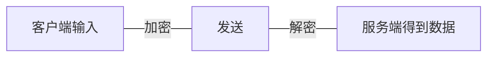
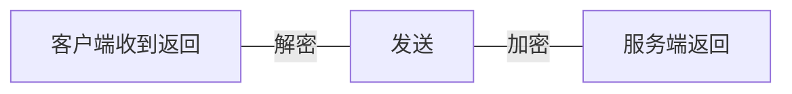

# Pluto Chat
## 程序分析
首先看到main函数

```cpp
void __fastcall __noreturn main(int a1, char **a2, char **a3)
{
    sockaddr addr; // [rsp+20h] [rbp-220h] BYREF
    char s_1[256]; // [rsp+30h] [rbp-210h] BYREF
    char s[268]; // [rsp+130h] [rbp-110h] BYREF
    int fd; // [rsp+23Ch] [rbp-4h]

    puts("Login to PlutoChat");
    printf("Username: ");
    fgets(s, 256, stdin);
    printf("Password: ");
    fgets(s_1, 256, stdin);
    fd = socket(2, 1, 0);                       // 创建一个ipv4套接字,类型是流式套接字
    if ( fd == -1 )
    {
        puts("Could not connect to PlutoChat servers. Try again later!");
        exit(0);
    }
    addr.sa_family = 2;
    *&addr.sa_data[6] = 0LL;
    *&addr.sa_data[2] = inet_addr("127.0.0.1");
    *addr.sa_data = htons(31337u);
    if ( connect(fd, &addr, 0x10u) )
    {
        puts("Could not connect to PlutoChat servers. Try again later!");
        exit(0);
    }
    sub_555555555CD7(fd);
    sub_55555555589A(fd, s, s_1);
    while ( !dword_55555555822C )
        usleep(0x186A0u);
    sub_5555555559E3(fd);
}
```

发现了关键的函数socket,再结合下面的内容,可以猜测到程序是一个客户端程序,会通过127.0.0.1:31337和服务端程序通信

```cpp
	fd = socket(2, 1, 0)
	
    addr.sa_family = 2;
    *&addr.sa_data[6] = 0LL;
    *&addr.sa_data[2] = inet_addr("127.0.0.1");
    *addr.sa_data = htons(31337u);
```

### 三个关键函数分析
之后我们继续跟踪一下三个关键函数

```cpp
    sub_555555555CD7(fd);
    sub_55555555589A(fd, s, s_1);
    while ( !dword_55555555822C )
        usleep(0x186A0u);
    sub_5555555559E3(fd);
```

#### 函数CD7
先分析第一个CD7函数


可以发现这里启动了一个线程,我们继续跟踪观察,可以发现这个线程一致再循环启动一个函数

```cpp
void __fastcall __noreturn start_routine(unsigned int *a1)
{
    unsigned int i; // [rsp+14h] [rbp-Ch]

    for ( i = *a1; ; main_func(i) );
}
```

继续跟踪,我们发现main_func中一直再调用read函数通过fd读入服务端发回的信息,如果校验通过,就会输出Login Successful的验证信息.


接下来我们来分析一下校验的流程,首先分析一下init_sbox函数
发现在return之前都是对key进行混淆,于是我们继续跟踪return的函数

```cpp
_BYTE *__fastcall init_sbox(_BYTE *sbox, unsigned int key_in)
{
    int v4; // [rsp+18h] [rbp-28h]
    _DWORD *key; // [rsp+28h] [rbp-18h]
    int k; // [rsp+30h] [rbp-10h]
    int j; // [rsp+34h] [rbp-Ch]
    int i; // [rsp+38h] [rbp-8h]
    char v9; // [rsp+3Fh] [rbp-1h]

    key = malloc(0x50uLL);
    malloc(0x100uLL);
    for ( i = 0; i <= 19; ++i )
    {
        key[i] = key_in;
        key_in = _ROL4___w(key_in, key_in & 0xF);
    }
    for ( j = 0; j <= 19; ++j )
    {
        v4 = key[j];
        key[j] = key[byte0[j]];
        key[byte0[j]] = v4;
    }
    for ( k = 0; k <= 79; ++k )
    {
        *(key + k) = v9 ^ byte1[*(key + k)];
        v9 = *(key + k);
    }
    return RC4_KSA(sbox, key, 0x50uLL);
}
```

从这里我们就可以很明显看出来这个函数的RC4特征了

```cpp
_BYTE *__fastcall RC4_KSA(_BYTE *sbox, __int64 key, unsigned __int64 keylen)
{
    _BYTE *newbuffer_1; // rax
    __int64 newc; // [rsp+20h] [rbp-18h]
    unsigned __int64 idx; // [rsp+28h] [rbp-10h]
    unsigned __int64 i; // [rsp+30h] [rbp-8h]

    *sbox = 0;
    newbuffer_1 = sbox;
    sbox[1] = 0;
    for ( i = 0LL; i <= 0xFF; ++i ) // 这里是初始化sbox
    {
        newbuffer_1 = &sbox[i + 2];
        *newbuffer_1 = i;
    }
    idx = 0LL;
    LOBYTE(newc) = 0;
    while ( idx <= 0xFF ) // 这里是KSA实现
    {
        newc = (sbox[idx + 2] + newc + *(idx % keylen + key));
        newbuffer_1 = swap(sbox, idx++, newc);
    }
    return newbuffer_1;
}
```

这里是标准的RC4实现,通过对比可以理解上面代码sbox应该是从sbox[2]索引开始计算的

```python
def KSA(key):
    """ KSA 密钥拓展 """
    S = list(range(256))
    j = 0
    for i in range(256):
        j = (j + S[i] + key[i % len(key)]) % 256
        S[i], S[j] = S[j], S[i]
    return S
 
def PRGA(S):
    """ PRGA """
    i, j = 0, 0
    while True:
        i = (i + 1) % 256
        j = (j + S[i]) % 256
        S[i], S[j] = S[j], S[i]
        K = S[(S[i] + S[j]) % 256]
        yield K
```

回到先前的地方分析5452函数.由于我们明白了这个是RC4加密,所以这里也很清晰了,函数52e5明显就是RC4的PRGA实现.
所以这个函数的作用就是,读入服务器返回的数据并解码.

```cpp
void __fastcall sub_555555555452(
        unsigned __int8 *newbuffer,
        unsigned __int8 *buf,
        unsigned __int8 *p_check_flag,
        unsigned __int64 nbytes)
{
    unsigned __int8 v4; // bl
    unsigned __int64 i; // [rsp+28h] [rbp-10h]

    if ( nbytes )
    {
        for ( i = 0LL; i < nbytes; ++i )
        {
            v4 = buf[i];
            p_check_flag[i] = v4 ^ sub_5555555552E5(newbuffer);
        }
    }
}

__int64 __fastcall sub_5555555552E5(unsigned __int8 *p_idx)
{
    p_idx[1] += p_idx[++*p_idx + 2];
    swap(p_idx, *p_idx, p_idx[1]);
    return p_idx[(p_idx[*p_idx + 2] + p_idx[p_idx[1] + 2]) + 2];

}
```

那么我们就知道了第一个函数是用来从服务器得到返回的字符串解密校验,并输出对应的状态.

#### 函数89a
现在分析89a函数,可以发现这个函数就是将我们的用户名和密码整理加密后发给了服务端
值得注意的是sub_555555555687()返回了一个48位的随机数作为密钥加密数据.

```cpp
ssize_t __fastcall sub_55555555589A(int fd, char **name, char *password)
{
    unsigned __int8 *buf; // [rsp+20h] [rbp-10h]
    unsigned __int8 n_1; // [rsp+2Eh] [rbp-2h]
    unsigned __int8 n; // [rsp+2Fh] [rbp-1h]

    n = strlen(name);
    if ( n && *(name + n - 1) == 10 )
        *(name + --n) = 0;
    n_1 = strlen(password);
    if ( n_1 && password[n_1 - 1] == 10 )
        password[--n_1] = 0;
    buf = malloc(n_1 + n + 3);
    *buf = 0;
    buf[1] = n;
    memcpy(buf + 2, name, n);
    buf[n + 2] = n_1;
    memcpy(&buf[n + 3], password, n_1);
    return sub_5555555556A7(fd, buf, n_1 + n + 3);
}

ssize_t __fastcall send_encypt(int fd, unsigned __int8 *data, unsigned __int64 data_len)
{
    unsigned __int8 *newbuffer; // [rsp+28h] [rbp-18h]
    unsigned int key; // [rsp+34h] [rbp-Ch]
    void *buf; // [rsp+38h] [rbp-8h]

    buf = malloc(data_len + 8);
    key = init_key();
    *buf = key;
    *(buf + 1) = data_len;
    newbuffer = malloc(0x102uLL);
    sbox_KSA(newbuffer, key);
    RC4(newbuffer, data, buf + 8, data_len);
    return send(fd, buf, data_len + 8, 0);
}

__int64 sub_555555555687()
{
    int v0; // ebx

    v0 = rand() << 16;
    return v0 | rand();
}
```

#### 函数sub_5555555559E3()

这个函数也就是不断读入用户输入,并加密发送给服务端

```cpp
void __fastcall __noreturn sub_5555555559E3(unsigned int fd)
{
    char s1[256]; // [rsp+10h] [rbp-200h] BYREF
    char s[256]; // [rsp+110h] [rbp-100h] BYREF

    while ( 1 )
    {
        printf("Type a username to send a message to, or 'EXIT' to exit: ");
        fgets(s, 256, stdin);
        if ( !strcmp(s, "EXIT") )
            break;
        while ( 1 )
        {
            printf("Send a message to %s (or 'EXIT' to select a new user): ", s);
            fgets(s1, 256, stdin);
            if ( !strcmp(s1, "EXIT") )
                break;
            sub_555555555751(fd, s, s1);
        }
    }
    puts("Exiting PlutoChat...");
    exit(0);
}

ssize_t __fastcall sub_555555555751(int fd, char *s, char *s1)
{
    unsigned __int8 *buf; // [rsp+20h] [rbp-10h]
    unsigned __int8 n_1; // [rsp+2Eh] [rbp-2h]
    unsigned __int8 n; // [rsp+2Fh] [rbp-1h]

    n = strlen(s);
    if ( n && s[n - 1] == 10 )
        s[--n] = 0;
    n_1 = strlen(s1);
    if ( n_1 && s1[n_1 - 1] == 10 )
        s1[--n_1] = 0;
    buf = malloc(n_1 + n + 3);
    *buf = 2;
    buf[1] = n;
    memcpy(buf + 2, s, n);
    buf[n + 2] = n_1;
    memcpy(&buf[n + 3], s1, n_1);
    return sub_5555555556A7(fd, buf, n_1 + n + 3);
}
```

## 解密流程
### 解法1
所以这个程序大致的流程就是



我们再仔细观察这个两个函数,我们很容易发现在解码消息的时候,我们的函数会取出编码在消息开头的key和len再进行解码,又由于RC4是对称加密,所以我们只需要将一样的数据发送给服务就可以得到解密之后的文本了.

```cpp
ssize_t __fastcall send_encypt(int fd, unsigned __int8 *data, unsigned __int64 data_len)
{
    unsigned __int8 *newbuffer; // [rsp+28h] [rbp-18h]
    unsigned int key; // [rsp+34h] [rbp-Ch]
    void *buf; // [rsp+38h] [rbp-8h]

    buf = malloc(data_len + 8);
    key = init_key();
    *buf = key;
    *(buf + 1) = data_len;
    newbuffer = malloc(0x102uLL);
    sbox_KSA(newbuffer, key);
    RC4(newbuffer, data, buf + 8, data_len);
    return send(fd, buf, data_len + 8, 0);
}
```

```cpp
int __fastcall main_func(int fd)
{
    unsigned int seed; // eax
    int buf__1; // eax
    _DWORD buf[2]; // [rsp+10h] [rbp-840h] BYREF
    unsigned __int8 check_flag; // [rsp+18h] [rbp-838h] BYREF
    unsigned __int8 j_2; // [rsp+19h] [rbp-837h]
    const char *v6; // [rsp+818h] [rbp-38h]
    unsigned __int8 k_1; // [rsp+827h] [rbp-29h]
    const char *v8; // [rsp+828h] [rbp-28h]
    unsigned __int8 j_1; // [rsp+833h] [rbp-1Dh]
    int buf__2; // [rsp+834h] [rbp-1Ch]
    __int64 sbox; // [rsp+838h] [rbp-18h]
    unsigned int nbytes; // [rsp+840h] [rbp-10h]
    unsigned int key; // [rsp+844h] [rbp-Ch]
    int j; // [rsp+848h] [rbp-8h]
    int i; // [rsp+84Ch] [rbp-4h]

    seed = time(0LL);
    srand(seed);
    read(fd, buf, 8uLL);
    key = buf[0];
    nbytes = buf[1];
    sbox = malloc(0x102uLL);
    sbox_KSA(sbox, key);
    read(fd, &check_flag, nbytes);
    RC4(sbox, &check_flag, &check_flag, nbytes);
    buf__1 = check_flag;
    buf__2 = check_flag;
    if ( check_flag == 1 )
    {
        buf__1 = puts("Login successful! Welcome to PlutoChat!");
        dword_55555555822C = 1;
    }
    else if ( buf__2 == 3 )
    {
        j_1 = j_2;
        v8 = malloc(j_2 + 1);
        for ( i = 0; i < j_1; ++i )
            v8[i] = *(&buf[2] + i + 2);
        k_1 = *(&buf[2] + j_1 + 2);
        v6 = malloc(k_1 + 1);
        for ( j = 0; j < k_1; ++j )
            v6[j] = *(&buf[2] + j_1 + j + 3);
        printf("%d %d\n", k_1, j_1);
        return printf("New message from %s: %s\n", v8, v6);
    }
    return buf__1;
}
```

在wireshark中筛选出有用的流量包.


接着就可以创建一个服务端,来发送这些信息.

```python
import socket
import time

# 定义要发送的数据
data2 = bytes.fromhex("5961965e01000000f2")
data3 = bytes.fromhex("43a72f7d4f0000000e6bcbc2f22c2ab292df5214621f539fb64957e5bc263200363280f254c9cef412c3daed1bca89945c4c8de150da6353ec04eb2c44aafb21841041f8dc032f7f31ed4a3d50477a9c5e96ba2c22a88e")
data4 = bytes.fromhex("7fc8fe7f48000000f31cd383bb6fdd8f41a8924099f79eda967f039fda8253b668843bd32cd8e6b085cd34f14563a3534c61b78e81c2246ed231daa7e93fba5634fe344c0524b1922569b8de54f391ba")

# 创建 TCP/IP 套接字
server_socket = socket.socket(socket.AF_INET, socket.SOCK_STREAM)

# 绑定服务端地址和端口
server_socket.bind(('127.0.0.1', 31337))

# 开始监听客户端连接，最多 1 个连接
server_socket.listen(1)
print("Server is listening on port 31337...")

# 等待客户端连接
client_socket, client_address = server_socket.accept()
print(f"Connection from {client_address} established.")

# 模拟服务器端发送数据
try:
    # 发送数据2（登录成功信息）
    client_socket.sendall(data2)
    print("Sent login success data (data2)")

    # 小延迟模拟真实通信
    time.sleep(1)

    # 发送数据3（用户间消息）
    client_socket.sendall(data3)
    print("Sent message data (data3)")

    # 小延迟模拟真实通信
    time.sleep(1)

    # 发送数据4（用户间消息）
    client_socket.sendall(data4)
    print("Sent message data (data4)")

finally:
    # 关闭与客户端的连接
    client_socket.close()
    print("Connection closed.")

# 关闭服务器
server_socket.close()
print("Server stopped.")
```

然后在ida中观察解密后的数据即可


```shell
Username: 1234
Password: 5678
Login successful! Welcome to PlutoChat!
Type a username to send a message to, or 'EXIT' to exit: 62 14
New message from givemethemoney: Hey can you give me that sensitive key you were talking about?
```

最后一个由于校验没通过,可以在堆栈中查看


flag: sun{S3cur1ty_thr0ugh_Obscur1ty_1s_B4D}

### 解法二
既然我们知道key,密文,长度编码在消息中,我们直接写出解密代码,解密相关的数据即可.

```python
import struct, binascii

S1 = [0xD,0x8,0x11,0xC,0xE,0x7,0x0,0x5,0x9,0x4,0xB,0x10,0x6,0x12,0xA,0x1,0x2,0x3,0xF,0x13] 
S2 = [
  0xBA,0x79,0xCE,0x55,0x64,0x13,0x62,0x21,0xBF,0xCC,0x96,0x0F,0x68,0x95,0x2D,0x51,0x7A,0x59,0xF6,0x44,0xE5,0x43,0x3E,0xB3,0xA3,0x81,0x4F,0xA6,0x36,0xFB,0x6D,0xF8,
  0xF7,0x1F,0x6B,0x42,0xA7,0xB7,0xBC,0x71,0x0D,0xB4,0xE0,0xB9,0x25,0x0A,0x28,0xA1,0x76,0x86,0x6C,0x27,0xD9,0x2A,0x6A,0x03,0xF1,0x72,0xDB,0x54,0x82,0x6F,0xBB,
  0x1C,0x5A,0x38,0xD2,0xBE,0x09,0x9B,0x15,0xB8,0x8F,0x78,0x4C,0x34,0x67,0xD7,0xAB,0x75,0x45,0x87,0x9D,0x10,0xE8,0xEB,0x32,0x8D,0xC5,0x46,0x65,0x0B,0x35,0xBD,
  0xEA,0x06,0xA5,0xDD,0xA4,0x5F,0x40,0x5D,0xFC,0x9A,0x5B,0xCB,0x89,0x91,0x5C,0xFE,0x66,0xFD,0xAA,0x37,0x02,0x12,0x98,0x6E,0x17,0xC9,0x50,0x20,0x39,0xC2,0xED,
  0xE7,0xB2,0x74,0xE2,0xEF,0x16,0x5E,0x99,0x47,0xF5,0x1E,0x23,0x01,0x57,0xA0,0x3B,0x1B,0x2B,0xEE,0xC1,0x58,0x9E,0xA9,0xCA,0xFF,0xC4,0x7B,0x4B,0x8E,0x48,0xCD,
  0x7C,0xC0,0x56,0xD0,0x33,0xC7,0x70,0x8B,0xE1,0x8C,0xC3,0x0E,0x1D,0x3D,0xDA,0xCF,0x11,0x73,0xEC,0xC6,0x92,0xB6,0x26,0x05,0xFA,0xF0,0xE6,0x0C,0x14,0x69,0x61,
  0xC8,0x60,0x31,0x9C,0x22,0xAC,0x9F,0x4E,0x49,0x29,0x3F,0x85,0xF3,0x53,0xF9,0x63,0xDF,0xD3,0xF2,0x00,0x2E,0x18,0xD1,0xDE,0x8A,0x52,0x08,0xE9,0xA2,0xE4,0x3A,
  0x83,0x7F,0x94,0xB5,0xD4,0xD5,0x77,0x07,0xDC,0x19,0x84,0xD8,0xAF,0xA8,0x93,0x7E,0xD6,0x2C,0xF4,0x41,0xB1,0x2F,0x7D,0x4D,0x97,0x1A,0x3C,0xB0,0x80,0x90,0x4A,
  0xAE,0x24,0x88,0xAD,0x04,0x30,0xE3
]

def derive_key(seed: int) -> bytes:
    key = bytearray(80)
    x = seed & 0xFFFFFFFF
    # A) 20×4B：小端写入 + 低4位决定的循环左移
    for i in range(20):
        key[4*i:4*i+4] = x.to_bytes(4, 'little')
        r = x & 0xF
        x = ((x << r) | (x >> (32 - r))) & 0xFFFFFFFF if r else x
    # B) 按 S1 重排 20 个 4B 槽
    for i in range(20):
        j = S1[i]
        for k in range(4):
            a, b = 4*i + k, 4*j + k
            key[a], key[b] = key[b], key[a]
    # C) S2 替换 + 前向异或反馈
    prev = 0
    for i in range(80):
        key[i] = S2[key[i]] ^ prev
        prev = key[i]
    return bytes(key)

def rc4_crypt(key: bytes, data: bytes) -> bytes:
    # KSA
    S = list(range(256)); j = 0; kl = len(key)
    for i in range(256):
        j = (j + S[i] + key[i % kl]) & 0xFF
        S[i], S[j] = S[j], S[i]
    # PRGA
    i = j = 0
    out = bytearray(len(data))
    for n in range(len(data)):
        i = (i + 1) & 0xFF
        j = (j + S[i]) & 0xFF
        S[i], S[j] = S[j], S[i]
        k = S[(S[i] + S[j]) & 0xFF]
        out[n] = data[n] ^ k
    return bytes(out)

def decrypt_record(hexblob: str):
    blob = bytes.fromhex(hexblob)
    seed, length = struct.unpack('<II', blob[:8])
    key = derive_key(seed)
    pt  = rc4_crypt(key, blob[8:8+length])
    return seed, length, pt

if __name__ == '__main__':
    hexmsg = "9b5fa5e44b000000f420fae91d6e90512b260b75da9a437afec536fb674f55f31d20817de08fac62f8e4ee1fb5e5e587924210d555a5bb2ed5e1c3efc6521b151c6cbd9e94119bd906e5557a30158758b815d6"
    seed, length, pt = decrypt_record(hexmsg)
    print(f"seed = 0x{seed:08X}, length = {length}")
    print("plaintext (hex):", pt.hex())
    try:
        print("plaintext (utf-8):", pt.decode('utf-8'))
    except UnicodeDecodeError:
        print("plaintext (utf-8):", pt.decode('utf-8', errors='replace'))

output: \x03\x11topsecretengineer7Of course! It's: sun{S3cur1ty_thr0ugh_Obscur1ty_1s_B4D}
```

